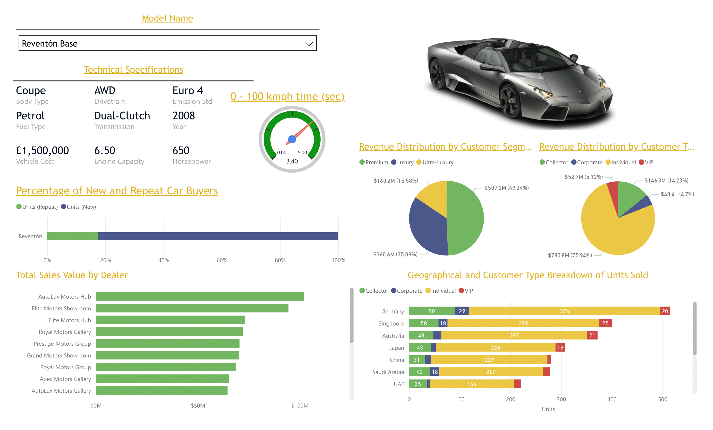
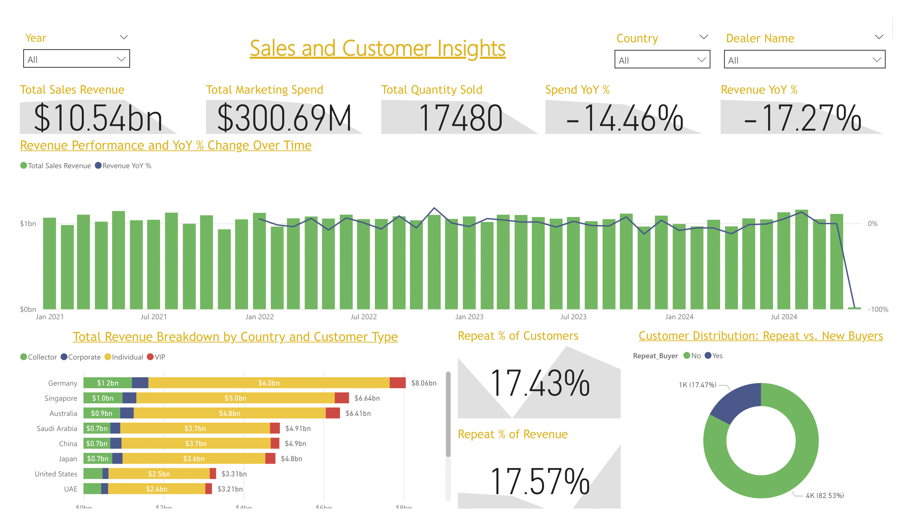
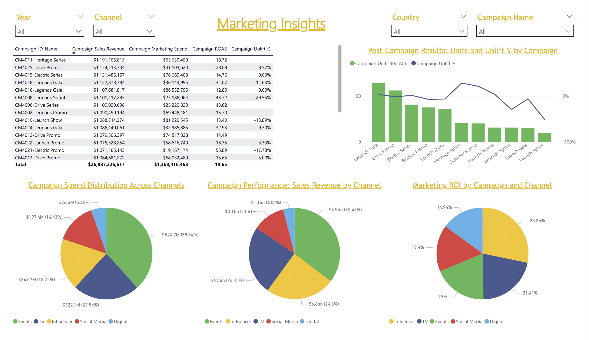

# 🏎️ Lamborghini Sales & Marketing Dashboard (Power BI)

A **data analytics project** built in **Power BI** to analyze Lamborghini’s global sales, customer behavior, dealer performance, and marketing ROI.  
The dashboard provides actionable insights across vehicle performance, customer segmentation, and campaign efficiency.

## 🧠 Project Inspiration

This dashboard was inspired by the work of [Divya Mehul Makwana](https://github.com/divyamehulmakwana-bit/Lamborghini-Dashboard-using-PowerBi-and-Snowflake/tree/main/Data%20Source)  
Their GitHub repository served as a foundation and creative springboard for this analysis—thank you for the inspiration.

---

**📁 Project Overview**

This project demonstrates end-to-end data analytics using Power BI for luxury automotive data.
The goal is to uncover insights about:

- Vehicle performance (0–100 km/h time, power, price)
- Customer segments and repeat buyer behavior
- Dealer and country performance
- Marketing campaign ROI and post-campaign uplift

---

## 🧩 Data Model

The data model integrates multiple datasets representing sales, vehicles, customers, dealers, and marketing campaigns.  

**Relationships:**
- `Vehicles[Vehicle_ID]` → `Sales[Vehicle_ID]`
- `Dealers[Dealer_ID]` → `Sales[Dealer_ID]`
- `Customers[Customer_ID]` → `Sales[Customer_ID]`
- `Marketing_Campaigns[Campaign_ID]` → `Sales[Promotion_Campaign]`
- `Date[Date]` → `Sales[Sale_Date]`

This structure enables multi-dimensional analysis across performance, geography, and time.

---

## ⚙️ Key Measures (DAX)

| Category | Measure | Description |
|-----------|----------|-------------|
| **Revenue Metrics** | `Total Sales Revenue` | Total value of all sales transactions |
|  | `Revenue YoY %` | Year-over-year revenue growth |
| **Marketing Metrics** | `Total Marketing Spend` | Total spend from campaigns |
|  | `ROI %`, `ROAS`, `Uplift %` | Evaluates marketing efficiency |
| **Customer Metrics** | `Repeat % of Customers` | % of customers who purchased more than once |
|  | `Repeat % of Revenue` | % of total revenue from repeat buyers |
| **Vehicle Metrics** | `Avg 0-100_kph_sec` | Average acceleration for vehicle model |
| **Dealer Metrics** | `Total Sales by Dealer` | Dealer performance by sales value |

---

## 📊 Dashboard Pages

### 1️⃣ Model Insights
- Shows vehicle specifications, 0–100 km/h time, and price  
- Interactive car image and selection by model  
- Percentage of new vs repeat car buyers  
- Top dealers by total sales value  
- Revenue distribution by **customer segment** and **customer type**

---

### 2️⃣ Sales & Customer Insights
- KPIs: **Total Sales Revenue**, **Total Marketing Spend**, **Total Units Sold**, **YoY %**  
- Combined line & column chart: revenue and YoY change over time  
- Revenue breakdown by **country and customer type**  
- KPIs for **Repeat % of Customers** and **Repeat % of Revenue**  
- Donut chart: distribution of **repeat vs new buyers**

---

### 3️⃣ Marketing Insights
- Campaign table with **ROI %, ROAS, and Uplift %**  
- Post-campaign performance: **units before & after campaign**  
- Pie charts for **spend and revenue by channel**  
- Marketing ROI comparison across **Events, Social Media, Influencers, and TV**

---

## 💡 Insights Highlights

- 🚗 **Performance:** The *Reventón Base* is the top-performing model with a 0–100 km/h time of 3.4 seconds.  
- 💰 **Revenue:** 2023 achieved the highest annual revenue at $12.7B.  
- 🌍 **Markets:** Germany, Singapore, and the USA are the strongest markets by total revenue.  
- 📈 **Marketing ROI:** *Legends Gala* and *Drive Promo* campaigns delivered the highest ROAS (>30×).  
- 🙋 **Customer Loyalty:** Repeat buyers make up **17%** of total customers, generating **~18%** of total revenue.

---

## 🧠 Skills Demonstrated

- Advanced **Power BI** modeling and visualization  
- **DAX** for KPIs, YoY, ROI, and time intelligence  
- **Data transformation** using Power Query  
- **Sales & Marketing Analytics** — ROI, ROAS, uplift, and channel efficiency  
- **Customer Segmentation** — repeat vs new buyer analysis  
- **Interactive Dashboard Design** — gauges, KPIs, and trend visuals  

---

## 🛠️ Tools & Technologies

| Tool | Purpose |
|------|----------|
| **Power BI Desktop** | Data modeling, DAX, and visualization |
| **Excel / CSV Files** | Data sources |
| **Snowflake (optional)** | Data warehousing |
| **GitHub** | Portfolio hosting & version control |

---

## 📸 Dashboard Snapshots

### 🧩 Model Insights  

### 📊 Sales & Customer Insights  

### 🎯 Marketing Insights  

## 👩‍💻 Author

**Vishal Venkateshan**  
📧 vishal95.venkateshan@gmail.com
🌐 [LinkedIn Profile](https://www.linkedin.com/in/vishal-venkateshan/)  

⭐ *If you found this project insightful, consider giving it a star on GitHub!*

Marketing performance analytics (spend vs return)

Customer segmentation & loyalty analysis

